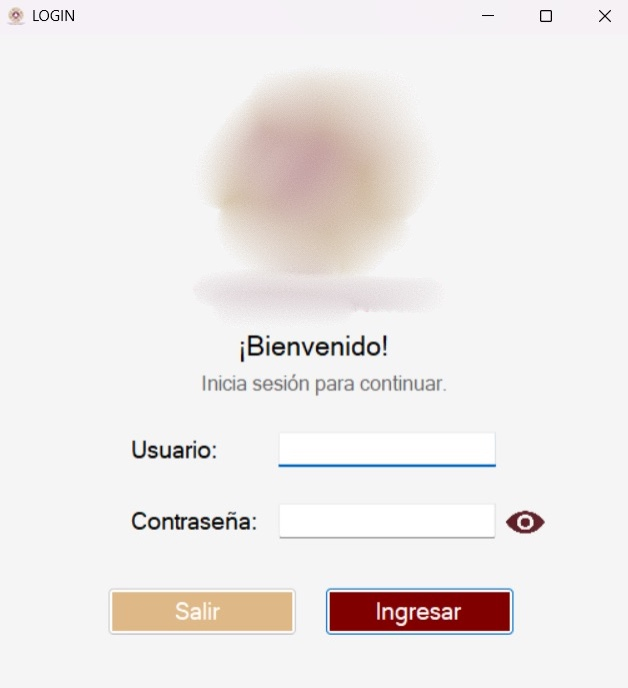
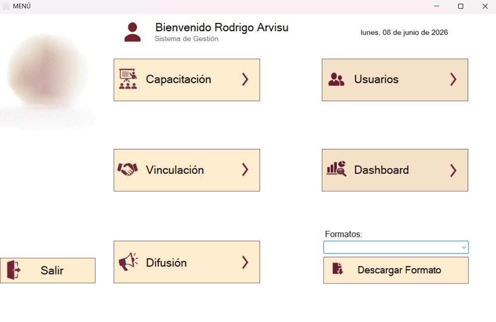
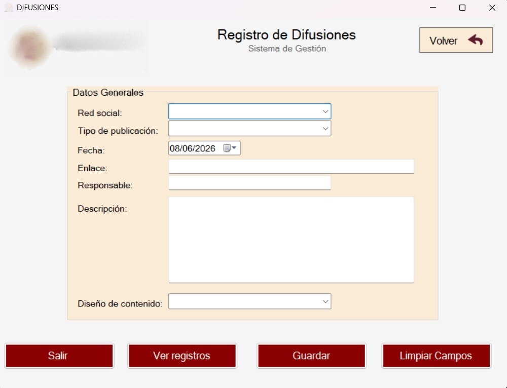
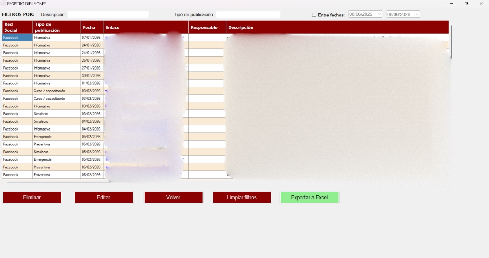
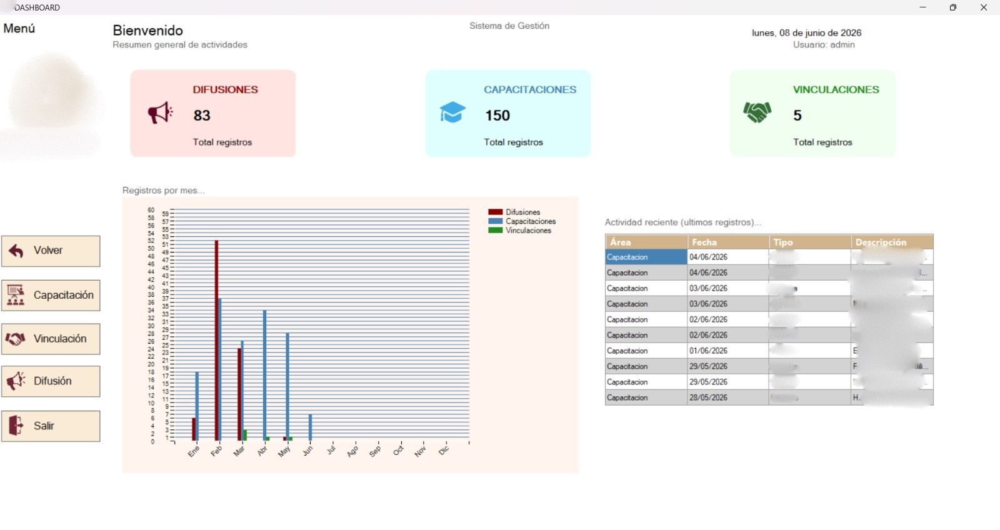

# Sistema de Gestión Interna 

## Descripción
Sistema de escritorio desarrollado en C# Windows Forms y SQL Server para la gestión y administración
de información interna.
La aplicación centraliza los registros, gestiona y consulta la información mediante módulos especializados, 
permitiendo optimizar procesos internos, mejora el orden y control de los registros y facilita la generación
de reportes. Además incorpora mecanismos de seguridad, control de accesos y auditorías.

## Tecnologías 
#### Lenguaje de programación
- C#
#### Framework
- Windows Forms (.NET Framework)

## Base de Datos 
- SQL Server

## Exportación de información 
- Microsoft Excel

## Funcionalidades 
#### Autenticación y Control de Acceso
- Inicio de sesión seguro mediante contraseñas cifradas 
- Gestión de usuarios mediante roles (usuario y admin)
- Restricciones según el rol de usuario

#### Gestión de Información
El sistema se organiza en diferentes módulos especializados para la administración de registros

Cada módulo permite: 
- Registrar 
- Consultar registros 
- Editar
- Eliminar
- Aplicar filtros (entre fechas o nombre)
- Consultar información por rangos de fechas

#### Reportes y exportación
- Exportación de registros a Excel
- Generación del reporte en Excel según los filtros aplicados 

#### Dashboard
- Visualización de indicadores generales 
- Resumen general de información 

#### Gestión Documental
- Acceso rápido a formatos y documentos de uso frecuente 
- Descarga de archivos desde el sistema

#### Auditoría 
- Registro automático de creación de registros 
- Registro de modificaciones realizadas 
- Identificación del usuario responsable de cada acción 
- Fecha y hora de creación

## Arquitectura del Sistema 
El sistema está compuesto por una aplicación de escritorio desarrollada en Windows Forms conectada a una 
base de datos (SQL Server) mediante ADO.NET.

## Capturas del sistema 

#### Inicio de Sesión

#### Menú 

#### Registro de información

#### Consultar, editar, eliminar y exportar registros 

#### Dashboard

